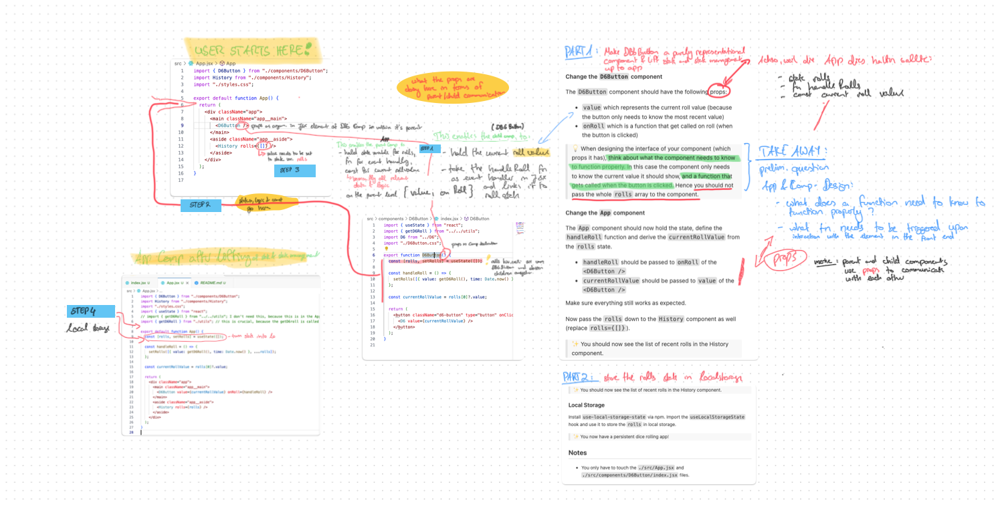

# React with Local Storage: Dice 🎲

This dice rolling app rolls a die (d6 = six sided die). Now you want to show recent dice rolls in a list and store them in local storage.

## My solution

  
Solution with image

  
  
  
  1) Problem

The App renders a three-dimensional model of a six-eyed dice.
By clicking on the rendered dice, a short animation gets triggered and the
model simulates a dice roll which ends on the model showing one side of a dice.

The animation works as intended, but the value of 1 to n dice rolls doesn't get saved anywhere.
This is because all the logic necessary to provide this functionality is currently within the DB6 Button.
The DB6 Button is a child comp of App and it doesn't contain all the components in itself to fully execute the intended logic.
However, the App does.

Therefore we need to lift the code containing logics and necessary variables/states up to the App.

2. Steps and Plan

TURN DB6BUTTON COMP INTO REPRESENTATIONAL COMP AND LIFT STATE AND STATE MANAGEMENT UP TO APP COMP

2. 1. Copy and pase rolls state, const handleRolls (event handler containg set function) and const currentValue to App
      This solves the problem of having the logic, states and variables necessary for the whole app within the limited scope of the child comp of App.

3. 2. Add the props value and onRoll to the DB6Button fn and it's respective JSX Element, so that App can communicate the
      necessary event handling logic to DB6Button, especially the execution of the dice roll itself which happends inside.

4. 3. Change the value of the JSX element History's attribute rolls= to the value of the state rolls.
      This solves the problem of the history of values of dice rolls (1 to n) not being displayed in the front end.

STORE ROLLS STATE IN LOCAL STORAGE

3. Mock Code and Notes on solving the challenge

My plan was almost complete, only missing one crucial step:
Changes on the import statements in DB6Button and App:

Change log DB6Button:

- delete useState, because it's not needed anymore
- delete import of getD&roll fn from utils, because it's not needed anymore

Change log App:

- add useState, because we have the state rolls in here now
- add import statement getD&roll fn from utils, because the getD6roll is called within the set fn within the event handler here now

## Task

### Lifting State Up

Look at the `./src/App.jsx` and `./src/components/D6Button/index.jsx` files.

Lift up the `rolls` state into the `App` component.

#### Change the `D6Button` component

The `D6Button` component should have the following props:

- `value` which represents the current roll value (because the button only needs to know the most recent value)
- `onRoll` which is a function that get called on roll (when the button is clicked)

> 💡 When designing the interface of your component (which props it has), think about what the component needs to know to function properly. In this case the component only needs to know the current value it should show, and a function that gets called when the button is clicked. Hence you should not pass the whole `rolls` array to the component.

#### Change the `App` component

The `App` component should now hold the state, define the `handleRoll` function and derive the `currentRollValue` from the `rolls` state.

- `handleRoll` should be passed to `onRoll` of the `<D6Button />`
- `currentRollValue` should be passed to `value` of the `<D6Button />`

Make sure everything still works as expected.

Now pass the `rolls` down to the `History` component as well (replace `rolls={[]}`).

> ✨ You should now see the list of recent rolls in the History component.

### Local Storage

Install `use-local-storage-state` via npm. Import the `useLocalStorageState` hook and use it to store the `rolls` in local storage.

> ✨ You now have a persistent dice rolling app!

## Notes

- You only have to touch the `./src/App.jsx` and `./src/components/D6Button/index.jsx` files.

## Development

To work locally, please install the dependencies using `npm i` first.

Run `npm run dev` to start a development server and open the displayed URL in a browser.

### Scripts

You can use the following commands:

- `npm run dev` to start a development server
